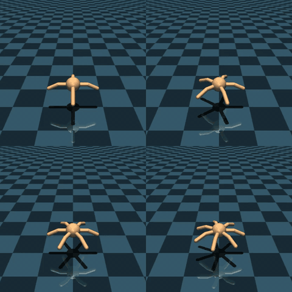

# Darwinian Engine

  

This project introduces the "Darwinian Engine," a hybrid framework for the synchronous co-evolution of robot morphology (hardware) and control policies (software). By combining Graph Convolutional Networks (GCN) and Morphological Domain Randomization (MDR), the system trains an exceptionally robust "Generalist Brain." It can directly drive multi-legged robots with diverse topological structures (e.g., 4 to 8 legs, asymmetric limbs, odd or even configurations) entirely without the need to retrain the neural network from scratch.